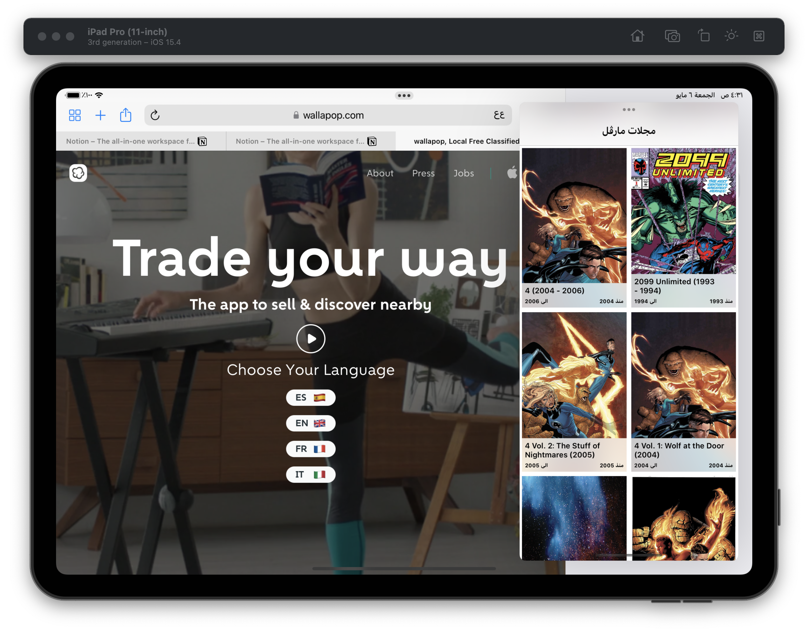

# MarvelExplorer


## Marvel Explorer **📺**

MarvelExplorer is an iOS Application to list Series From Marvel. and it's for Wallapop’s task for iOS Software Engineer hiring process.

In this document i will give you an overview about the project, grab a cup of coffee ☕

### Requirements

- See a list/collection of items from the Marvel API.
- Search or filter the contents of this list/collection.
- See the full details of any item from this list/collection.

In this rest of the project, i will discusses how i tried to achieve the requirements.

### Principles and goals

---

Since day 1  principles and goals where set to be able to deliver a good quality and fulfill the requirements in an elegant, and modern way. 

the goals and principles are mainly based on the great discussion i had with Jesús Andaluz(he’s amazing !, would buy him a ☕️ if accepted).

 in our discussion Jesus discussed with me how the iOS Developers in Wallapop work in teams and that project is divided into modules and that testability aspect is very important in the environment, so the goals are:

1. To enable some level of modularity, Clean architecture is used as an architecture in the app.
2. Enable both WhiteBox Testing, and black box testing for the UI.
3. Testability of all Project Components is a must.
4. MVVM is used for the UI Side(Reactive using  apple’s Combine), to ensure that UI responsibilities are divided which is something we could leverage in the future for testability.
5. Embracing Value Types instead of references, as it’s faster and reduces source of bugs.
6. Having an eye on cross-device support(iPad/iPhone/Mac) 
7. Integrating Continues integration, so we can make our lives easier to be pretty sure that every commit fulfill our requirements.
8. Embracing Protocol oriented programming.
9. Embracing  modern Swifty/UIkit APIs like UIComposableDataSources and DiffableDataSources.
10. Back Support until iOS 13
11. Dark/light mode support 
12. Maintaining Code quality using SwiftLint.
13. support for L10N

In The following sections i will discuss main layers of the app

## Architecture


### Layers ⚒

- Presentation Layer = ViewModels, and Views, using Combine for binding.
- Domain Layer = Entities , Use cases, repositories (protocols)
    - Entities: Represent the main business of app (e.g: Series, Character...etc).
    - Repositories (Protocols only): Specifies how can/should the data be provided to the the app. (e.g MarvelSeriesRepository).
    - UseCases: used to do any business logic on the data retrieved (e.g: FetchSeriesUseCase).
- Data Repositories Layers = Repos implementation + API(Networking)
    - Repositories Implementations: Represents the repositories used to supply Data, e.g (DefaultSeriesRepository, which fetches from Network).
    - API(Networking): Contains necessary Modules + DTO to map Network responses to Domain Layer Entities.


### ****Architecture concepts 🏗****

a lot of the techniques and concepts used in this project was inspired from the following: 

- [Clean architecture](https://blog.cleancoder.com/uncle-bob/2012/08/13/the-clean-architecture.html)
    
    Using uncle’s bob architecture is the first step into introducing modularity and flexibility between components, by applying dependency inversion principle to place boundaries between high-level components and low-level components.
    
- [Flow](https://medium.com/@dkw5877/flow-coordinators-333ed64f3dd) [Coordinator](http://khanlou.com/)r & [Navigator Pattern](https://medium.com/@ghislain.deff.pro/the-navigator-pattern-for-ios-1e1a3baa0cba)
    
    Which handles application and navigation between various Flows, using Coordinators along with Navigators result in a decoupled navigation where controllers are not aware about the context of presentation.
    
- Dependency Injection, without 3rd Party
Dependency injection used to provide the app the app with dependencies needed for it to start working, this will become very important in the testing stage where everything is decoupled and we can control the dependencies
- Application mocking (Using Fake App Delegate)
    
    which helps into app mocking app delegate, needed when doing UI Tests Using EarlGrey 2
    
- Image Caching
    
    to reduce network calls image caching is implemented.
    
- [App Delegate Composite](https://www.vadimbulavin.com/refactoring-massive-app-delegate/)
    
    I know how can AppDelegate.swift can grow, we don’t want this anymore, using App Delegate composite makes it easier to divide the app delegate into smaller chunks (Composites).
    
- Error Handling
    
    Using Swift’s Result We can be sure that errors flow inside the pipeline of publishers until the view, All errors of combine publishers are set to never, because in most cases we don’t want to terminate the downStream if any error occurs.
    
- View Decoupling
    
    View are decoupled from view controllers, to enable modularity, and making it more reusable if needed, also Delegates, and dataSources are separated from the Views, to reduce the responsibility, and increase reusability.
    
- [DTOs](http://martinfowler.com/eaaCatalog/dataTransferObject.html)
- CI Pipeline


## User Interface 🎨

---


When working on UI of this project, my goals are: 

- Achieving landscape/portrait support.
- UI Elements should have low memory print.
- UI Elements should respect User’s local: RTL, and LTR.
- Being able to handle dynamic data(various text sizes).
- being able to be extended easily to add more elements to the UI if needed.
- Support for catalyst.

**For this i’ve used UICollectionViews and UITableViews, and stackViews in the app**





1. using TableViews, and collectionViews  provide a modularity as we can extend the design with many UI Elements
2. Table View are modular and could be used to implement a lot of designs, instead of using scrollViews
3. since table/collection views reuse their cells, we can be pretty sure that we are getting the best pferoamcne 
4. The usage of stackviews enables us to handle dynamism of data, and to re-arrange UI elements easily (for example change the axis of Stack on device rotation)
5. Both elements are apple’s native ones, so we are sure that it respects localization, and respects accessibility.
6. TableViews Sources and delegates are separated into their classes, so we can be suer that they have their responsibilities.
7. Auto Layout Constraint were made using SnapKit Library, which makes it less verbose to handle Constraints
8. Stretchy Headers are implemented in their views, so they can re-used across the app.
9. No Hard coding for any colors, using system colors, and if any color is needed they would be placed in Color Assets to support dark/light modes.


## Testability ✅

---

> “***Legacy code is code without tests.”***
Michael C. Feathers.
> 

I believe that writing tests for codebases isn’t a luxury thing. it’s important as much as shipping code.

writing code when testability in mind is something important which helps me write cleaner code, and think more about abstractions, it even helps me discover edge casses.

In this project, the following layers are testable

- Application Coordinators
- Navigator
- Network Service ( which i’ve made video about it since two years, in arabic.)
- Repositories
- ViewModels
- Use Cases
- UI (testable using EarlGrey & XCUITesting)

in this project you can find about 29 test cases.

### Unit Tests(21 Test Case)

inside MarvelExplorerTests folder (MarvelExplorerTests Target)

| Test Name | Test Purpose |
| --- | --- |
| test_startsApplicationsFlow | Test that application flow is started correctly and that the root controller is set. |
| test_loadFinishedSuccessfully | Tests that a successful response is sent to the client of service |
| test_loadFailedWithJsonParseError | Tests that a failed response is sent to the clients of service.
and that error is DecodingError |
| test_loadFailedWithInternalError | Tests a failed response because of internal error. |
| test_fetchSeriesFails_onNetworkError | tests that a failure is sent to clients of repository in case of invalid response |
| test_fetchSeriesSucceeds | tests that a success is sent to clients of repository in case of valid response. |
| test_fetchSeriesPaginatorNotNil | Tests that a paginator is set in repository after making first call, which is lated used to load more pages note: pagination responsibility is removed from ViewModel to reduce it’s responsibility. |
| test_fetchSeriesPagination_isCorrect | Tests that next offset is aligned with expected values |
| test_fetchSeriesDomainsSucceeds | Tests that data is retuned from repository succeeds |
| test_FetchSeries_onAppear | Tests that series is fetched on Appear. |
| test_StateIsLoading_onPageRequest | Tests that loading is being sent to view when requesting one more page. |
| test_StateIsLoading_onAppear | Tests that loading is sent on appear. |
| test_returnAllSeries_IfQueryIsEmpty | Tests that all Series is returned when search is empty. |
| testSearchSeries_when_QueryIsInTitle | tests that when a user enters a string which appears Series title it will be returned. |
| testSearchSeries_when_QueryIsInYear | makes sure that when a user enters a string in Series title it will be filtered |
| test_loadsImageFromNetwork | Tests that an image is returned. |
| test_fetchSeriesPagination_afterTwoCalls | tests that new results from pagination is sent correctly to the view along with the old page. |
| test_fetchSeriesPagination_concatenation | Tests that old page is still before the new page. |
| test_paginator_nextOffset_whenLimitIsReached | When a limit is reached of paginator is reached, same offset should be returned |
| test_paginator_nextOffset_whenHasPages |  |
|  |  |
|  |  |

| Mock | Purpose |
| --- | --- |
| MarvelSeriesRepositoryMock | to more Series repository |
| MarvelSeriesCoverRepositoryMock | to mock series covers repository.  |
| SeriesListNavigatorMock | mocks the navigator which used later in UI tests, when lunching the app using fake Delegate |
| URLProtocolMock | Mocks URLProtocol which is lated used in NetworkServiceMock |
|  |  |

### UI Tests (8 test cases)

UITests using XCUItest are used to make sure that UI elements are placed as expected

| test_application_isEmbeddedInNavigation | Tests if the main app is embedded inside a navigation controller. |
| --- | --- |
| test_seriesCell_contains_Thumbnail | Tests that a series Cell contain the thumbnail |
| Tests that a series Cell contains end Year label | Tests that a series Cell contains end Year label |
| test_seriesCell_contains_startYear | Tests that a series Cell contains start Year label |
| test_application_isLoadingOnLaunch | Used to tests if loading appears on launch  |
| test_SeriesDetail_isPushed | Tests that SeriesDetail is pushed when Series Cell is tapped. |
| test_SeriesDetailOrder | Tests that series details are placed in order, Series Description, then duration, then writers |
| testLaunchPerformance | Tests app launch, baseline is 1.5 second. |

White box UI Tests is achieved by FakeAppDelegate(which gets selected from main.swift in tests.), and Using EarlGrey.

⚠️ Note 1: EarlyGrey 2 has some problems when integrated in a project which has cocoa pods inside it, integrating it in a modern project seems to very hard (if not impossible)

i’ve worked on getting it to work for a whole day and a half, but it didn’t work and i ended up removing it, but i’ve left commented test cases if you want to take a look on it. the strange thing that i can get it to work as expected on my older projects, i will keep looking at this issue and update this repo if i managed to get it working. ☹️

| test_showDetails_whenTapOnItem | tests that a call to seriesListNavigatorMock.showDetailsForSeries is called, thus details screen is presented. |
| --- | --- |
| test_SeriesUpdatedInCollectionView | tests that SeriesLists gets updated whenever a series is published to ViewModel |
| test_initialStateTitle | Tests initial state title of screen to be “Marvel Explorer” |

## Perfromance 🏃🏻‍♂️

---

Performance is very important, if the app drains user’s battery they would remove it, if it’s not smooth, they would remove it, for this i’ve takes the following measures.

- Not using a lot of libraries, to reduce linking time on app launch.
- CollectionView should scroll on 60 fps
- App mush launch within 1.5 seconds( a test case is placed for it)
- No memory leaks ( c’mon, memory leaks aren’t accepted even if we don’t care about Performance !!)


 


## Continues Integration 🔁

---


CI/CD player very important rule into shipping amazing features fast to users, in this project i’ve demonstrated the usage of FastLane to run iOS Tests+ GitHub Actions, to run Faselane and do necessarily commands before running it 

in theory, a-lot of GH Actions can be added to Fastlane, but i’ve left it like this for the sake of it. also, also, it’s very important to note that API Keys shouldn’t be left in the CI pipeline, it should be placed inside environment variables, which is safer, but i didn’t have much time for it.

### Security Measures 🚔

---

MarvelAPI Keys are not left as string inside the source code, instead i’m using CocoapodsKeys, why ? 

- Having API keys isn’t secure since Hackers can extract it easily using Reverse Engineering
- When placing a project on OSS, we don’t want to expose the API to public world

CocoaPodsKeys obsofucate the keys inside the app bundle, when a developer is installing the app they would get asked to enter the APIKey


### Targets 🎯
---

This app contains multiple Targets

1- MarvelExplorer, containts the app, run it and have fun 🍿

2-MarvelExplorerTests, contains unit test

4-MarvelUITests, contains UI Tests.

3- MarvelExplorerDomain, used to enclose everything related to the domain layer inside it, to be a modular.

4-MarvelEXplorerData, used to enclose data layer.

5- MarvelExplorerUI, used to enclose everything related to the presentation layer.

6- MarvelExplorerShared, contains extensions and code shared by other targets.

### How To install
---

1. * Fork the project, main branch

```bash
git clone https://github.com/iMostfa/MarvelExplorer-Wallapop.git
```

- cd into project using termianal
1. pod install, which will ask for MarvelAPIKey, MarvelPrivateKey, you can enter the following if you don’t have time to generate a new one

```scheme
privateKey: 9afe7a8a513912bdd65b63452e7df5e700d62fcf

publicKey: 8a8dcc9159c1b3c1ba42a7cc3a047572
```

### Third party libraries 🏭
---

while working on production projects, i tend to reduce the number of 3rd party libraries as much as possible as i can, why ? 

- More control on the codebase, having dependencies makes the codebase tied to it
- Reduces App size, this’s very important aspect to me, added a-lot of libraries increases the app size which isn’t something we want to have.
- Faster app launches (since it takes sometime to link libraries on launch)
- Most of the time you don’t need all the features provided by a library(for example, Alamofire is amazing, but do you need all of its features?)

| SnapKit
https://github.com/SnapKit/SnapKit | Used for setting up constraints |
| --- | --- |
| SVProgressHUD
https://github.com/SVProgressHUD/SVProgressHUD | used to present beautiful loading indicators |
| R 
https://github.com/mac-cain13/R.swift | not included in this project, but i would use it if the app contains assets, to get strongly typed fonts, images, and colors. |
| Instabug | not included in this project, but I would use it for analytics if the app is published to the app store. |

### Improvements & Feedback 📝
---

What makes a great code base and improves it is having a feedback from colleguos and experianced people like YOU(YES, the reader)👨🏻‍💻

i tried to provide a balance between all aspects while working on this project, the improvemnets could be: 

- Integrating EarlGrey for better UI testability
- moving some of GH Actions to FastLane
- Reducing tests times (Specially UI tests)
- Supporting screenshots Generation from Tests
- Applying Retriers on failable network requests
- Currently Series Filtering is done only on already fetched series(thus, in ViewModel), 
we could use the API for this in future, and implement more filters
- Better handling for branches, and improving my abilities in testing

did i missed anything ? is there something i was suppused to do in a better way ? please let me know, i want to learn and i want to be a better developer

do you know what would be the best developer ? it would be working with the amazing people at iOS Team of Wallapop 😉
